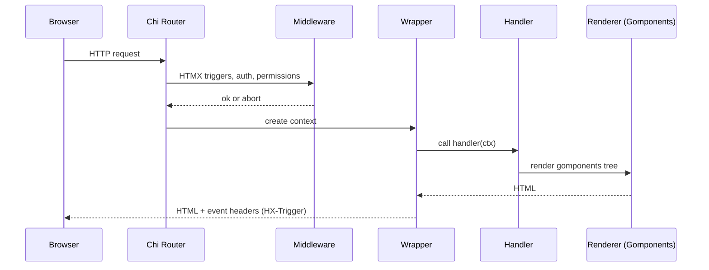
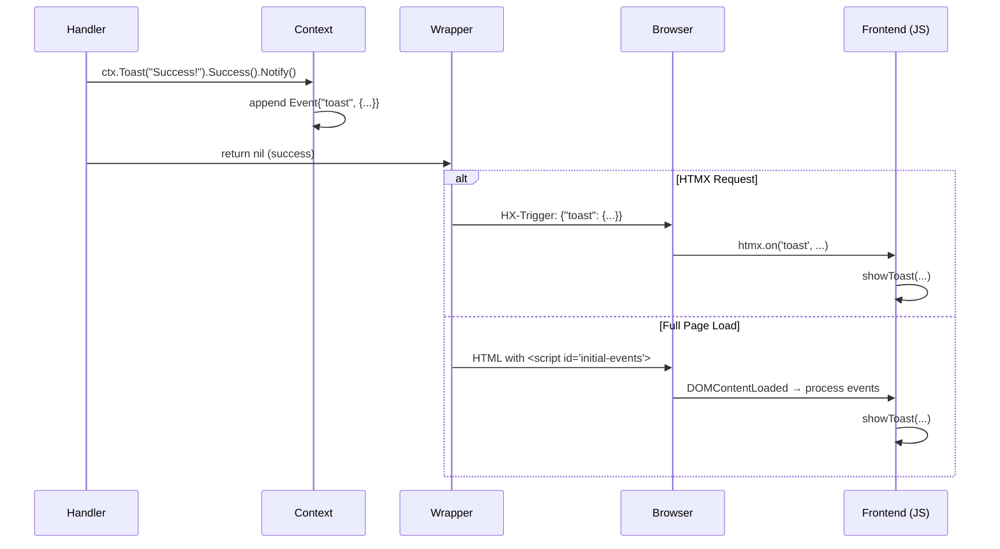
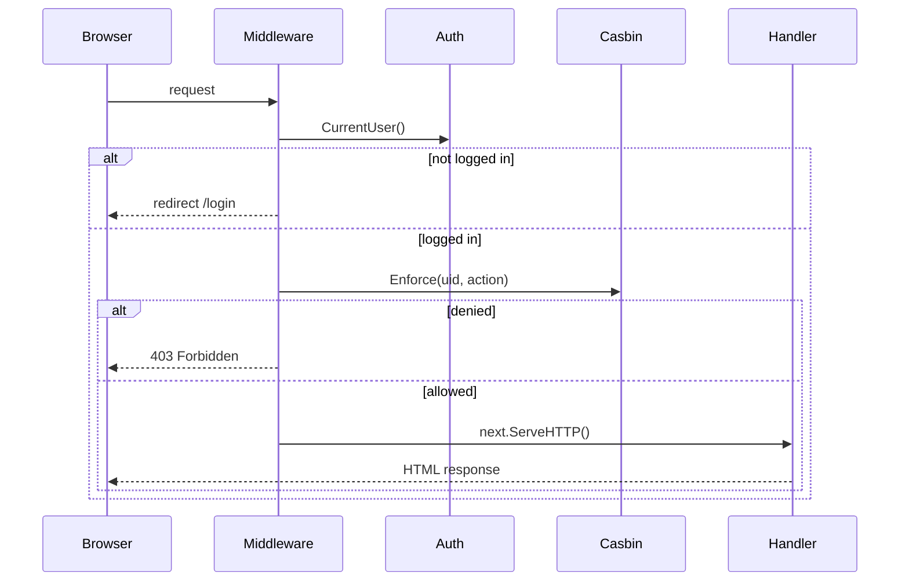

# Architecture

This document describes the **concrete architecture** of the `hagg` project.
It explains not only *how* the code is structured, but more importantly *why*.

Throughout this document, **we** refers to the authors and maintainers of this project —
this is our shared baseline.

> **Project status:** `hagg` is still early **WIP (work in progress)**.
> The structure is intentionally simple, and we expect it to evolve as we learn.
>
> **The journey matters:** This architecture is the result of exploration, discussion,
> and iteration. We document our decisions and trade-offs openly.
> If something seems unconventional, there's likely a reason — read on!

---

## Core Idea

The application follows a **server-centric architecture**:

- HTML is rendered on the server (Gomponents)
- Interaction happens over HTTP (HTMX)
- surreal.js provides syntactic sugar for DOM operations
- Alpine.js is used for small client-side state only
- The backend stays explicit and boring (Chi, middleware, plain Go)

This baseline exists to make "normal web apps" feel straightforward again:
forms, tables, and stateful pages — without SPA complexity.

---

## Context (important)

We are **not professional web developers**, nor specialists in frontend or backend frameworks.
This is a **hobby project**, created to explore ideas, deepen understanding,
and learn by building real things.

So this architecture should be read as:

- Honest and practical
- Experience-driven, not academic
- Open to correction and improvement as our understanding grows
- **Process-oriented** — the journey and learning are as important as the output

---

## High-Level Request Flow

1. **Chi** matches a route.
2. **Middleware** runs (HTMX triggers, auth, permissions).
3. **Wrapper** creates a `handler.Context` and calls the handler.
4. A **handler** renders Gomponents into `handler.Context`.
5. The **wrapper** commits events (via `HX-Trigger` header or initial-events script).
6. HTMX endpoints return partial HTML or trigger client-side updates.
7. **Frontend** processes events (toast, auth-changed, etc.) with surreal.js.

The important part: *handlers are simple functions* that work with a lightweight context wrapper.



---

## Stack Components in Detail

### Backend

#### Chi Router

We use **Chi v5** as our HTTP router.

**Why Chi?**

- stdlib-compatible (`http.Handler`, `http.HandlerFunc`)
- Minimal, no framework overhead
- Composable middleware
- Idiomatically Go

**Example routing:**

```go
r := chi.NewRouter()

// Middleware
r.Use(middleware.Logger)
r.Use(sessionManager.LoadAndSave)

// Public routes
r.Get("/", deps.Wrap(pages.Home))

// Protected routes
r.Group(func(r chi.Router) {
    r.Use(middleware.RequireAuth(deps))
    r.Get("/dashboard", deps.Wrap(pages.Dashboard))
})
```

#### Context Wrapper

We use a **lightweight context wrapper** instead of frameworks like Gin or Echo.

**The `handler.Context` type:**

```go
type Context struct {
    Res http.ResponseWriter  // Explicit field (no embedding)
    Req *http.Request        // Explicit field (no embedding)

    logger *slog.Logger
    events []Event
}
```

**Why explicit fields?**

- No embedding = no interface pollution
- Compatible with all stdlib middleware
- Clear ownership and access patterns

**Helper methods (minimal):**

```go
func (c *Context) Render(node g.Node) error
func (c *Context) Toast(msg string) *toast.Builder
func (c *Context) Event(name string, data any)
func (c *Context) Logger() *slog.Logger
```

**Handler pattern:**

```go
type HandlerFunc func(*Context) error

func (w *Wrapper) Wrap(h HandlerFunc) http.HandlerFunc {
    return func(res http.ResponseWriter, req *http.Request) {
        ctx := &Context{
            Res:    res,
            Req:    req,
            logger: w.logger,
            events: make([]Event, 0),
        }

        if err := h(ctx); err != nil {
            w.logger.Error("handler error", "error", err)
            http.Error(res, "Internal Server Error", 500)
        }

        // Commit events (HX-Trigger or initial-events)
    }
}
```

**Usage in handlers:**

```go
func Dashboard(ctx *handler.Context, deps *app.Deps) error {
    ctx.Toast("Welcome!").Success().Notify()
    return ctx.Render(pages.DashboardPage())
}
```

#### Session Management (scs)

We use **alexedwards/scs** for session management.

**Why scs?**

- stdlib-compatible
- Multiple store backends (cookie, SQLite, Postgres, Redis)
- Simple API
- Actively maintained

**Default: Cookiestore (zero deps, stateless)**

```go
sessionManager := scs.New()
sessionManager.Store = cookiestore.New([]byte(secretKey))
sessionManager.Lifetime = 24 * time.Hour
```

**Optional: Database-backed sessions**

```go
// Via environment variable
switch cfg.SessionStore {
case "sqlite":
    sessionManager.Store = sqlite3store.New(db)
case "postgres":
    sessionManager.Store = postgresstore.New(db)
case "redis":
    sessionManager.Store = redisstore.New(pool)
default:
    sessionManager.Store = cookiestore.New([]byte(secretKey))
}
```

**Flash messages:**

Flash messages are session-based (for redirects):

```go
// Set flash (handler)
sessionManager.Put(ctx.Req.Context(), "flash", map[string]string{
    "message": "Logged out successfully",
    "level":   "info",
})

// Read flash (layout)
if flash := sessionManager.PopString(ctx.Req.Context(), "flash"); flash != "" {
    ctx.Event("toast", parseFlash(flash))
}
```

Flash is converted to an event during layout rendering, creating a unified toast system.

### Frontend

#### HTMX

HTMX powers progressive enhancement:

- Form submissions without JavaScript
- Partial page updates
- Polling and lazy loading
- WebSocket support

**Example:**

```html
<button hx-post="/logout" hx-swap="none">Logout</button>
```

The backend responds with `HX-Trigger: auth-changed`, and the frontend refreshes the nav.

#### Alpine.js

Alpine.js handles **client-side state** (dropdowns, modals, tabs):

```html
<div x-data="{ open: false }">
    <button @click="open = !open">Toggle</button>
    <div x-show="open">Content</div>
</div>
```

**Important:** Alpine is for **UI state only**, not application state.

#### surreal.js

surreal.js provides **syntactic sugar** for DOM operations:

```js
// Vanilla JS
document.getElementById('toast-container')

// surreal.js
me('#toast-container')
```

**Why surreal.js?**

- Reduces boilerplate in event handlers
- Chainable API (`me(el).classAdd('foo').classRemove('bar')`)
- Small (~2KB minified)
- No build step

**Example (toast rendering):**

```js
function showToast({ message, level = 'info' }) {
    const container = me('#toast-container-bottom-right')

    const toastHtml = `
        <div class="toast toast-${level} opacity-0">
            ${message}
        </div>
    `

    container.insertAdjacentHTML('beforeend', toastHtml)
    const toast = container.lastElementChild

    me(toast).classRemove('opacity-0')

    setTimeout(() => {
        me(toast).classAdd('opacity-0')
        setTimeout(() => me(toast).remove(), 300)
    }, 5000)
}
```

#### Tailwind CSS (Pico-inspired)

We use **Tailwind CSS** with a **Pico.css-inspired design system**.

**Why Tailwind?**

- Full control over styling
- No external CSS dependencies
- Purging for small bundle size

**Why Pico-inspired?**

- Clean, minimal aesthetics
- Good defaults for forms, buttons, cards
- Professional without over-design

**Custom theme:**

```js
// tailwind.config.js
module.exports = {
  theme: {
    extend: {
      colors: {
        primary: { /* blue scale */ },
        success: '#10b981',
        error: '#ef4444',
        warning: '#f59e0b',
        info: '#3b82f6',
      },
      borderRadius: {
        'pico': '0.375rem',
      },
      boxShadow: {
        'pico': '0 0 0 1px rgba(0, 0, 0, 0.05), ...',
      },
    },
  },
}
```

**Build process (no npm/node):**

```bash
# Standalone binary (installed once)
tailwindcss -i ./static/css/base.css -o ./static/css/styles.css --watch
```

See `static/css/base.css` for component styles.

---

## Event System (Detailed)

The event system is **server-driven** and **header-based**.

### Two Event Types

#### 1. HTMX Events (via `HX-Trigger` header)

For HTMX requests, events are sent via the `HX-Trigger` response header:

```http
HX-Trigger: {"toast": {"message": "Success!", "level": "success"}}
```

The frontend listens with:

```js
htmx.on('toast', (e) => {
    showToast(e.detail)
})
```

#### 2. Initial Events (via `<script id="initial-events">`)

For full page loads, events are rendered as JSON in the HTML:

```html
<script type="application/json" id="initial-events">
[
  {"name": "toast", "payload": {"message": "Welcome!", "level": "info"}},
  {"name": "auth-changed", "payload": null}
]
</script>
```

The frontend processes on load:

```js
document.addEventListener('DOMContentLoaded', () => {
    const initialEventsEl = me('#initial-events')
    if (initialEventsEl) {
        const events = JSON.parse(initialEventsEl.textContent)
        events.forEach(processEvent)
        initialEventsEl.remove()
    }
})
```

### Unified Event Processing

Both types feed into the same event processor:

```js
function processEvent(event) {
    switch(event.name) {
        case 'toast':
            showToast(event.payload)
            break
        case 'auth-changed':
            htmx.trigger(me('#nav'), 'refresh')
            break
        case 'permission-denied':
            // ... handle permission denial
            break
    }
}
```

### Backend Event API

**Emit an event:**

```go
ctx.Event("auth-changed", nil)
```

**Toast shorthand:**

```go
ctx.Toast("Operation successful!").Success().Notify()
```

**Under the hood (toast):**

```go
func (t *Toast) Notify() {
    t.ctx.Event("toast", t)
}
```

### Event Flow Diagram



---

## Toast / Notification System

The toast system is **event-driven** and **unified**.

### Backend (Go)

**Toast builder:**

```go
type Toast struct {
    Message  string `json:"message"`
    Level    string `json:"level"`    // success, error, warning, info
    Timeout  int    `json:"timeout"`  // ms, 0 = stay forever
    Position string `json:"position"` // bottom-right, top-right, etc.
}
```

**Fluent API:**

```go
ctx.Toast("User created")
    .Success()
    .SetTimeout(3000)
    .SetPosition("top-right")
    .Notify()
```

### Frontend (JavaScript)

**Toast rendering (with surreal.js):**

```js
function showToast({ message, level = 'info', timeout = 5000, position = 'bottom-right' }) {
    const container = me(`#toast-container-${position}`)

    const toastHtml = `
        <div class="toast toast-${level} opacity-0 transition-opacity">
            <div class="flex items-center gap-3">
                <div>${getIcon(level)}</div>
                <div>${message}</div>
            </div>
        </div>
    `

    container.insertAdjacentHTML('beforeend', toastHtml)
    const toast = container.lastElementChild

    // Enter animation
    setTimeout(() => me(toast).classRemove('opacity-0'), 10)

    // Auto-remove
    if (timeout > 0) {
        setTimeout(() => {
            me(toast).classAdd('opacity-0')
            setTimeout(() => me(toast).remove(), 300)
        }, timeout)
    }
}
```

### Why This Design?

- **Unified:** One `showToast()` function for HTMX and full-page loads
- **Server-driven:** Backend controls notification logic
- **No external libraries:** Custom implementation with Tailwind
- **Flexible:** Supports different positions, timeouts, levels

---

## Authentication

Authentication is **session-based** and deliberately minimal:

- We store the logged-in user UID in the session (key: `uid`)
- `Auth.CurrentUser(ctx)` reads the session and loads the user from `user.Store`

**Auth struct:**

```go
type Auth struct {
    sessionManager *scs.SessionManager
    userStore      user.Store
}

func (a *Auth) CurrentUser(ctx context.Context) (*user.User, error) {
    uid := a.sessionManager.GetString(ctx, "uid")
    if uid == "" {
        return nil, ErrNotAuthenticated
    }
    return a.userStore.GetByUID(uid)
}

func (a *Auth) Login(ctx context.Context, uid string) {
    a.sessionManager.Put(ctx, "uid", uid)
}

func (a *Auth) Logout(ctx context.Context) {
    a.sessionManager.Remove(ctx, "uid")
}
```

**Middleware:**

```go
func RequireAuth(deps *app.Deps) func(http.Handler) http.Handler {
    return func(next http.Handler) http.Handler {
        return http.HandlerFunc(func(w http.ResponseWriter, r *http.Request) {
            user, err := deps.Auth.CurrentUser(r.Context())
            if err != nil {
                // Not authenticated
                deps.SessionManager.Put(r.Context(), "flash", "Please log in")
                http.Redirect(w, r, "/login", http.StatusFound)
                return
            }

            // Add user to request context
            ctx := context.WithValue(r.Context(), "user", user)
            next.ServeHTTP(w, r.WithContext(ctx))
        })
    }
}
```

---

## Authorization (Permission Layer)

### Goals

- Permissions should be configurable without code changes
- Handlers should stay clean ("require X to do Y")
- Error cases should be visible (misconfigured policy/model)

### Casbin Integration

We use **Casbin** as the authorization engine:

- `model.conf` defines the evaluation model (RBAC)
- `policy.csv` defines roles/permissions and user-role assignments
- `internal/authz.MustNewEnforcer()` loads both from the working directory

**Why file-based?**

When we ship a single binary, we can place `model.conf` and `policy.csv` next to it.
No database required for authorization.

### Permissions as Actions

We model permissions as plain action strings:

- `user:create`
- `user:list`
- `user:delete`
- `selfdestroy`

This keeps the policy readable and avoids "object explosion" early on.

**Example policy:**

```csv
p, admin, user:create
p, admin, user:list
p, admin, user:delete

p, user, user:list

g, alice, admin
g, bob, user
```

### Middleware: RequirePermission

```go
func RequirePermission(deps *app.Deps, action string) func(http.Handler) http.Handler {
    return func(next http.Handler) http.Handler {
        return http.HandlerFunc(func(w http.ResponseWriter, r *http.Request) {
            user, err := deps.Auth.CurrentUser(r.Context())
            if err != nil {
                // Not authenticated → redirect
                http.Redirect(w, r, "/login", http.StatusFound)
                return
            }

            allowed, err := deps.Enforcer.Enforce(user.UID, action)
            if err != nil {
                // Policy/model error → 500
                http.Error(w, "Authorization error", 500)
                return
            }

            if !allowed {
                // Denied → 403 + warning
                http.Error(w, "Forbidden", 403)
                return
            }

            next.ServeHTTP(w, r)
        })
    }
}
```

**Usage:**

```go
r.Group(func(r chi.Router) {
    r.Use(middleware.RequirePermission(deps, "user:list"))
    r.Get("/users", deps.Wrap(pages.UserList))
})
```

### Flow Diagram



---

## Rendering Model

We use **Gomponents** for type-safe HTML rendering.

**Key idea:**

- A **page** is `func(*handler.Context, *app.Deps) error`
- The handler renders Gomponents into `handler.Context`

**Example page:**

```go
func Dashboard(ctx *handler.Context, deps *app.Deps) error {
    user, _ := deps.Auth.CurrentUser(ctx.Req.Context())

    page := layout.Base(
        html.H1(g.Text("Dashboard")),
        html.P(g.Textf("Welcome, %s!", user.Name)),
    )

    return ctx.Render(page)
}
```

**Render helper:**

```go
func (c *Context) Render(node g.Node) error {
    c.Res.Header().Set("Content-Type", "text/html; charset=utf-8")
    return node.Render(c.Res)
}
```

**Why Gomponents?**

- Type-safe (compile-time checking)
- No templates (no runtime parsing)
- Pure Go (no external DSL)
- Composable (functions returning nodes)

---

## Directory Layout (Detailed)

```
cmd/
  main.go             # composition root (flags, db, server start)

internal/
  app/
    deps.go           # dependency container

  auth/
    auth.go           # session-based auth (scs)

  authz/
    enforcer.go       # Casbin setup

  config/
    config.go         # env + .env loading

  session/
    store.go          # session store setup (cookie/sqlite/postgres/redis)

  middleware/
    chi.go          # Chi-specific middleware (RequireAuth, RequirePermission, etc.)

  frontend/
    layout/
      base.go         # HTML skeleton
      nav.go          # navigation
      events.go       # initial-events renderer

    pages/
      login/          # login page + handlers
      dashboard/      # dashboard page
      users/          # user list

    shared/
      link.go         # link helpers
      container.go    # layout helpers

  user/
    user.go           # domain model + store interface
    store_sqlite/
      store.go        # SQLite implementation

migrations/
  001_initial.sql

static/
  css/
    base.css          # Tailwind input
    styles.css        # Tailwind output (generated)

  js/
    app.js            # event processing, toast rendering
    surreal.js        # surreal.js library
    alpine.js         # Alpine.js (CDN or local)
    htmx.js           # HTMX (CDN or local)

model.conf            # Casbin model
policy.csv            # Casbin policies
justfile              # task runner (css-build, css-watch)
tailwind.config.js    # Tailwind configuration
```

---

## Composition Root

The composition root lives in `cmd/main.go`.

**Responsibilities:**

- Parse flags (`-config`, `-new-user`)
- Load config (`internal/config`)
- Open database (`database/sql`)
- Run migrations
- Choose concrete implementations (e.g. `store_sqlite`)
- Setup session manager (cookiestore, sqlite, etc.)
- Load Casbin enforcer
- Start the server with fully wired dependencies

**Example:**

```go
func main() {
    // Load config
    cfg := config.Load()

    // Open database
    db, err := sql.Open("sqlite3", cfg.DatabasePath)
    if err != nil {
        log.Fatal(err)
    }

    // Session manager
    sessionManager := session.Setup(cfg, db)

    // User store
    userStore := store_sqlite.New(db)

    // Auth
    auth := auth.New(sessionManager, userStore)

    // Casbin enforcer
    enforcer := authz.MustNewEnforcer()

    // Dependencies
    deps := &app.Deps{
        Users:          userStore,
        Auth:           auth,
        Enforcer:       enforcer,
        SessionManager: sessionManager,
        Logger:         slog.Default(),
    }

    // Router
    r := setupRouter(deps)

    // Start server
    log.Printf("Server starting on :%s", cfg.Port)
    http.ListenAndServe(":"+cfg.Port, r)
}
```

This keeps the rest of the code free of "how do we build things?" concerns.

---

## What We Expect to Change

As we add real pages and features, we expect:

- More page packages under `internal/frontend/pages`
- More store implementations (in-memory/dev vs sqlite vs postgres)
- Richer authorization (maybe object-based rules later)
- Better error handling and observability (structured logging, metrics)
- Improved event system (more event types, better error handling)

The goal is not stability at all costs, but **clarity during growth**.

---

## Why This Architecture?

### What We Optimized For

- **Simplicity** — minimal abstractions, boring code
- **Explicitness** — no magic, clear data flow
- **Replaceability** — swap persistence, sessions, auth without rewriting everything
- **Learning** — we document decisions, iterate, and improve as we learn

### What We Did NOT Optimize For

- **Performance at scale** — this is a baseline for small-to-medium apps
- **Enterprise patterns** — no hexagonal architecture, no CQRS, no event sourcing
- **Frontend richness** — no SPA, no reactive framework, no virtual DOM

### Trade-offs We Accept

- **More boilerplate** than frameworks (but we know what each line does)
- **Less magic** than ORMs (but we control our queries)
- **Manual CSS** with Tailwind (but we have full control)

---

## Influences & Inspirations

- **Go stdlib philosophy** — simple, explicit, composable
- **HTMX** — HTML over the wire, progressive enhancement
- **Pico.css** — clean, minimal design
- **Gomponents** — type-safe templates
- **Chi** — stdlib-compatible routing
- **alexedwards** — session management patterns (scs)
- **surreal.js** — syntactic sugar without build complexity

---

## Final Thoughts

This architecture is **not perfect**, and it's **not finished**.

It's the result of exploration, discussion, and iteration.
We document our decisions, discuss trade-offs, and learn by building.

If you're looking for production-ready stability, wait for v1.0.0.
If you want to understand *why* things work the way they do, welcome aboard!

**The journey matters as much as the destination.**
