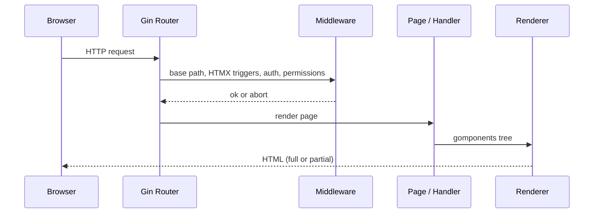
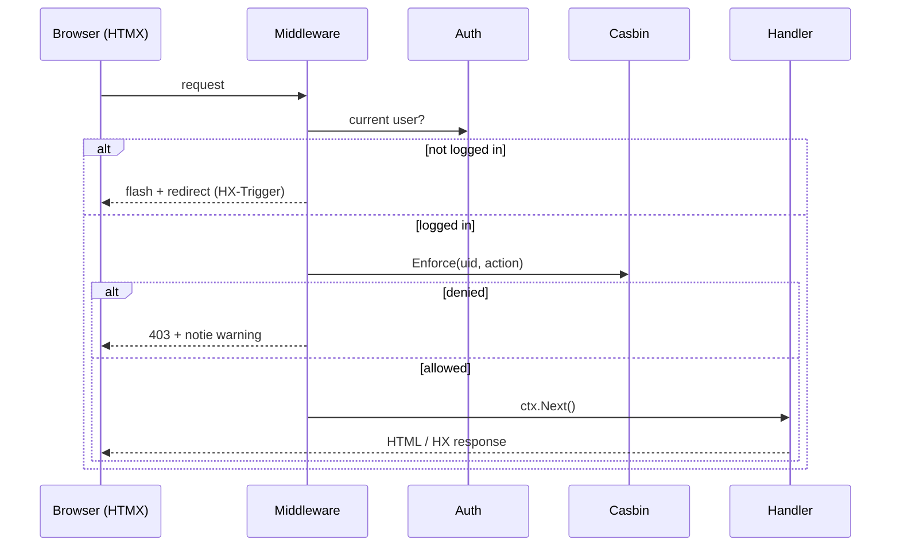

# Architecture

This document describes the **concrete architecture** of the `hagg` project.
It explains not only *how* the code is structured, but more importantly *why*.

Throughout this document, **we** refers to the authors and maintainers of this project —
this is our shared baseline.

> **Project status:** `hagg` is still early **WIP (work in progress)**.
> The structure is intentionally simple, and we expect it to evolve as we learn.

---

## Core Idea

The application follows a **server-centric architecture**:

- HTML is rendered on the server (Gomponents)
- interaction happens over HTTP (HTMX)
- Alpine.js is used for small client-side state only
- the backend stays explicit and boring (Gin, middleware, plain Go)

This baseline exists to make “normal web apps” feel straightforward again:
forms, tables, and stateful pages — without SPA complexity.

---

## Context (important)

We are **not professional web developers**, nor specialists in frontend or backend frameworks.
This is a **hobby project**, created to explore ideas, deepen understanding,
and learn by building real things.

So this architecture should be read as:

- honest and practical
- experience-driven, not academic
- open to correction and improvement as our understanding grows

---

## High-Level Request Flow

1. **Gin** matches a route.
2. **Middleware** runs (base path, HTMX triggers, auth, permissions).
3. A **page handler** renders a Gomponents tree into `http.ResponseWriter`.
4. HTMX endpoints return partial HTML or trigger client-side updates.
5. Flash / notification state is rendered via shared helpers.

The important part: *pages are functions* that return HTML nodes.




---

## Event Bus (Header-based)

In addition to the classic request/response flow, hagg uses a **lightweight, server-driven event bus** implemented via HTTP response headers.

Instead of a client-side global event system or state store, the backend emits **semantic events** that the frontend reacts to declaratively. The primary mechanism is `HX-Trigger` (optionally combined with small custom headers).

### Characteristics

- **Server-driven**: events originate exclusively in backend code
- **Decoupled**: middleware, handlers, and pages do not need to know each other
- **HTMX-native**: no custom JavaScript event framework
- **State-light**: no global JS store or event broker

### Typical Events

- `auth-changed` — login or logout
- `flash` — flash / notie notifications
- `permission-denied` — authorization failures

These events allow UI reactions (reload parts of the page, show alerts, redirect) without embedding control flow into JavaScript.

---

## Directory Layout

A simplified overview:

```
cmd/                # composition root (flags, db setup, server start)
internal/
  app/              # dependency container (Deps)
  auth/             # session-based authentication
  authz/            # authorization (Casbin)
  config/           # env + .env config
  db/               # DB open helpers
  flash/            # flash messages stored in session
  http/
    middleware/     # gin middleware
    render/         # DRY rendering helpers (gomponents)
  frontend/
    layout/         # skeleton/base/nav
    pages/          # page packages (login, ...)
    shared/         # link helpers, containers, flash rendering
  notie/            # small notification abstraction (notie.js)
  user/             # domain model + store interface
  user/store_sqlite # sqlite implementation
migrations/         # SQL migrations
static/             # static assets (also embedded)
model.conf
policy.csv
```

---

## Composition Root

The composition root lives in `cmd/main.go`.

Responsibilities:

- parse flags (`-config`, `-new-user`)
- load config (`internal/config`)
- open database (`internal/db`)
- choose concrete implementations (e.g. `store_sqlite`)
- start the server with fully wired dependencies

This keeps the rest of the code free of “how do we build things?” concerns.

---

## Dependency Container

`internal/app.Deps` collects dependencies that handlers/pages need:

```go
type Deps struct {
    Users    user.Store
    Auth     *auth.Auth
    Enforcer *casbin.Enforcer
}
```

We pass `Deps` down into:

- page render functions
- HTMX handlers
- middleware that needs access to auth/authorization

This is intentionally boring dependency injection: just structs and parameters.

---

## Rendering Model

We use Gomponents for HTML rendering.

Key idea:

- a **page** is `func(ctx *gin.Context, deps app.Deps) g.Node`
- a shared renderer turns that into a `gin.HandlerFunc`

See: `internal/http/render/page.go`

This keeps handlers DRY and makes pages easy to test (pure-ish functions returning nodes).

---

## Authentication

Authentication is session-based and deliberately minimal:

- we store the logged-in user UID in the session (`internal/auth`, key `uid`)
- `Auth.CurrentUser(ctx)` reads the session and loads the user from `user.Store`

Middleware:

- `RequireAuth` blocks access if there is no current user
- for HTMX it can set flashes / triggers so the UI reacts properly

---

## Authorization (Permission Layer)

### Goals

- permissions should be configurable without code changes
- handlers should stay clean (“require X to do Y”)
- error cases should be visible (misconfigured policy/model)

### Casbin integration

We use **Casbin** as the authorization engine.

- `model.conf` defines the evaluation model
- `policy.csv` defines roles/permissions and user-role assignments
- `internal/authz.MustNewEnforcer()` loads both from the working directory

> The files live in the project root on purpose:
> when we ship a single binary, we can place `model.conf` and `policy.csv` next to it.

### Permissions as actions

We model permissions as plain action strings, for example:

- `user:create`
- `user:list`
- `user:delete`
- `selfdestroy`

This keeps the policy readable and avoids “object explosion” early on.
If we later need object-based rules (ABAC), the Casbin model can evolve.

### Middleware: RequirePermission

`internal/http/middleware/require_permission.go` combines two steps:

1. ensure the user is logged in (same behavior as `RequireAuth`)
2. enforce a permission with Casbin

Outcomes:

- **not logged in** → flash + redirect
- **policy/model error** → 500 (config error)
- **denied** → 403 + warning
- **allowed** → `ctx.Next()`

Usage example:

```go
rg.GET(
    "/users",
    middleware.RequirePermission(deps, "user:list"),
    render.Page(deps, users.Page),
)
```




---

## Flash + Notifications

Two small UX helpers:

- **flash messages** stored in session (`internal/flash`)
- **notie** alerts (`internal/notie`) rendered in the layout

The layout reads flash state and emits a notie event, so it works for both full page loads
and HTMX swaps.

---

## Static Assets

Static files live in `static/` and are served under `/static`.

We also embed them into the Go binary (`embed`) so deployments can be a single artifact.

---

## What We Expect to Change

As we add real pages and features, we expect:

- more page packages under `internal/frontend/pages`
- more store implementations (in-memory/dev vs sqlite vs other DBs)
- richer authorization (maybe object-based rules later)
- better error handling and observability (structured logging, etc.)

The goal is not stability at all costs, but **clarity during growth**.
